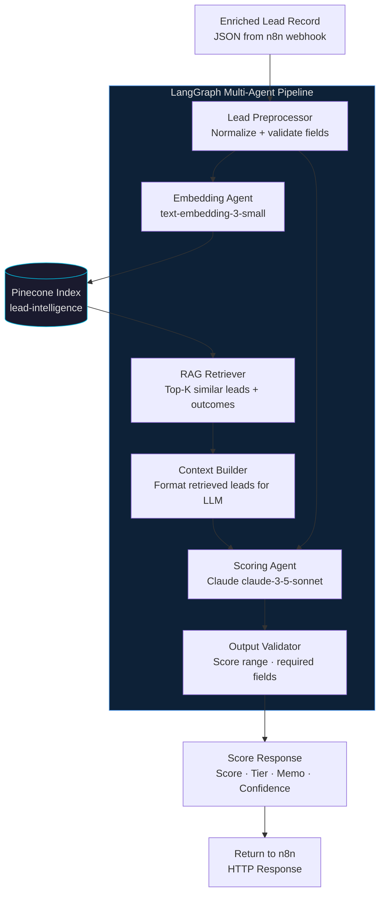
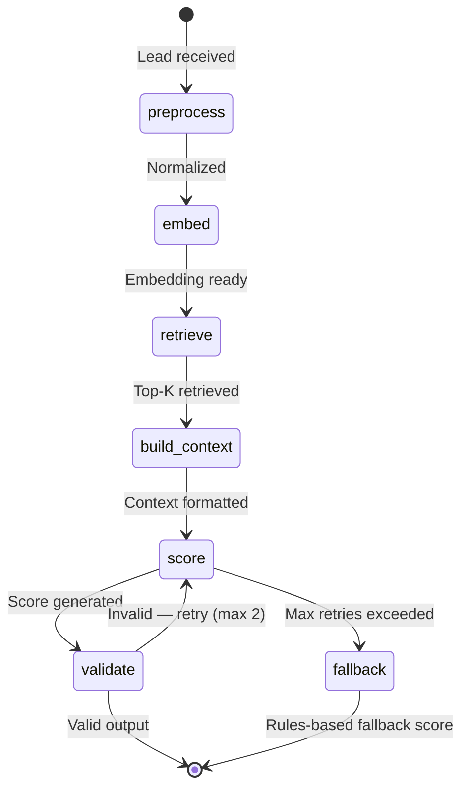

# Agentic Lead Scoring Engine
**myAutoBots.AI | Python + LangChain + LangGraph + Pinecone**

> RAG-backed lead intelligence engine. Scores B2B leads 0–100 using enrichment data, behavioral signals, and context retrieved from historical deal outcomes — not just rules.

📅 [Book a free 30-min revenue diagnostic](https://calendly.com/ssam8005/30min) · 🌐 [myautobots.ai](https://myautobots.ai)

**Used in:** [n8n Revenue Automation — Workflow 05](https://github.com/ssam8005/n8n-revenue-automation/blob/main/workflows/05-intent-scoring-pipeline.md)

---

## What This Does

Most lead scoring systems are rules-based: assign points for company size, title seniority, and industry match. That approach ignores the most valuable signal available — your own deal history.

This engine:
1. Embeds the enriched lead record
2. Retrieves the top-5 most similar historical leads from Pinecone (with their outcomes)
3. Passes lead + context to a LangGraph multi-agent pipeline for reasoning
4. Returns a score (0–100), tier (Hot/Warm/Cold), and natural-language reasoning memo

The scoring agent reasons like a senior sales rep reviewing a lead — not like a spreadsheet.

---

## Architecture



---

## Multi-Agent Flow (LangGraph)



---

## Quick Start

### 1. Install dependencies

```bash
pip install -r requirements.txt
```

### 2. Configure environment

```bash
cp .env.example .env
# Fill in your API keys
```

### 3. Initialize Pinecone index

```bash
python scripts/init_pinecone.py
```

### 4. Run the scoring server

```bash
python src/server.py
# Starts webhook server on port 8080
```

### 5. Score a lead

```bash
curl -X POST http://localhost:8080/score \
  -H "Content-Type: application/json" \
  -d '{
    "lead_id": "lead-001",
    "email": "jane.doe@example.com",
    "company": "Acme SaaS",
    "title": "VP Sales",
    "company_size": 45,
    "industry": "B2B SaaS",
    "lead_source": "inbound_demo_request",
    "enrichment_provider": "apollo"
  }'
```

### Example response

```json
{
  "lead_id": "lead-001",
  "score": 84,
  "tier": "HOT",
  "confidence": 0.91,
  "reasoning": "Strong ICP alignment — Series A SaaS company (45 employees), VP Sales with purchasing authority. Retrieved context: 3 of 5 most similar historical leads were closed-won, average 26 days to close. Common close signal: inbound demo request from VP-level (present here). Recommend same-day outreach.",
  "recommended_sequence": "saas-hot-6step",
  "suggested_angle": "Pipeline velocity at current growth stage",
  "processing_time_ms": 1840
}
```

---

## Repo Structure

```
agentic-lead-scoring/
├── README.md
├── requirements.txt
├── .env.example
├── src/
│   ├── server.py              # FastAPI webhook server
│   ├── pipeline.py            # LangGraph pipeline definition
│   ├── agents/
│   │   ├── preprocessor.py    # Lead normalization agent
│   │   ├── embedder.py        # Embedding agent
│   │   ├── retriever.py       # Pinecone RAG retrieval agent
│   │   ├── scorer.py          # Claude scoring agent
│   │   └── validator.py       # Output validation agent
│   ├── models.py              # Pydantic models
│   └── config.py              # Configuration management
├── scripts/
│   └── init_pinecone.py       # Initialize Pinecone index with historical data
└── docs/
    └── architecture.md        # Extended architecture documentation
```

---

## Related Repos

- [neural-gtm-sprint](https://github.com/ssam8005/neural-gtm-sprint) — Full methodology and engagement framework
- [n8n-revenue-automation](https://github.com/ssam8005/n8n-revenue-automation) — Workflow 05 calls this server

---

*Built by [Sammy Samet](https://linkedin.com/in/ssamet) — Principal Technologist, [myAutoBots.AI](https://myautobots.ai)*
