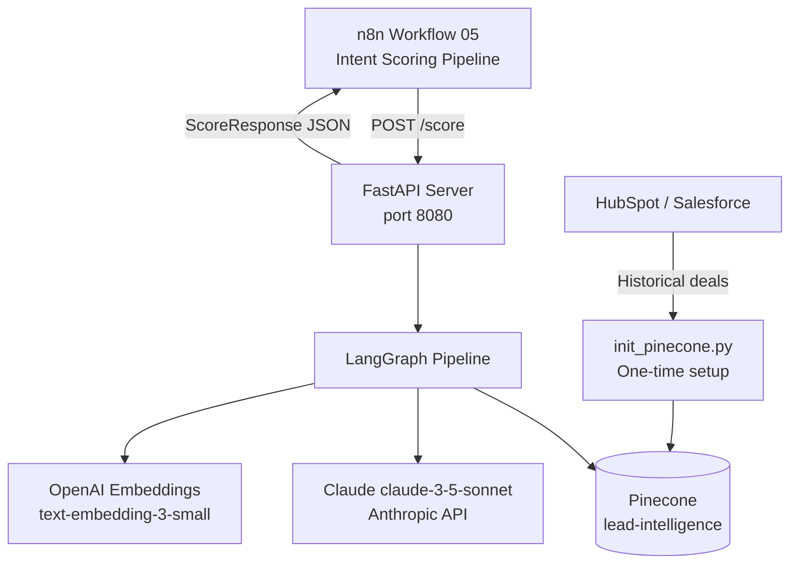
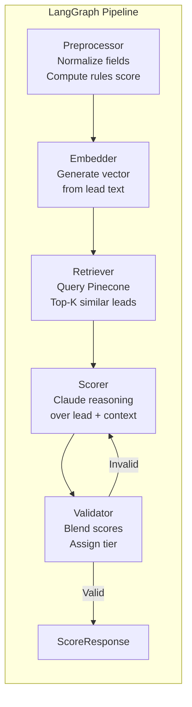
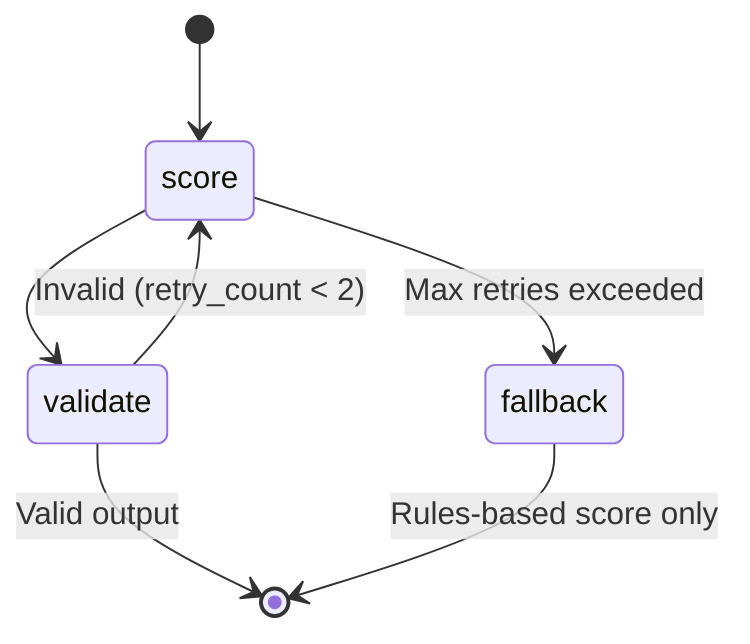

# Architecture — Agentic Lead Scoring Engine
**Extended Technical Reference**

---

## System Context



---

## Agent Responsibilities



---

## Pinecone Index Design

Each historical lead stored with embedding + metadata:

```
Index: lead-intelligence
Dimension: 1536 (text-embedding-3-small)
Metric: cosine

Metadata per vector:
  lead_id          string
  industry         string
  company_size     integer
  title            string
  outcome          enum: closed_won | closed_lost | ghosted | timing_objection | nurture
  days_to_close    integer | null
  deal_value       float | null
  close_signals    string[]
  objections       string[]
```

The index grows over time as closed deals are added. More historical data = more accurate retrieval = better scores.

---

## Score Blending

```
Final Score = (AI Score × 0.70) + (Rules Score × 0.30)

Rules Score components:
  Industry fit:    25%
  Company size:    20%
  Title seniority: 25%
  Tech stack:      15%
  Lead source:     15%

Tier thresholds:
  HOT  ≥ 70
  WARM ≥ 40
  COLD  < 40
```

---

## Retry Logic



If Claude returns invalid JSON or an out-of-range score, the pipeline retries up to 2 times before falling back to the rules-based score alone.

---

## Extending the Index

To add real historical leads from your CRM:

```python
from scripts.init_pinecone import build_text
from pinecone import Pinecone
from openai import OpenAI

# Load from CRM export
deals = load_closed_deals_from_crm()

for deal in deals:
    text = build_text(deal)
    embedding = openai.embeddings.create(model="text-embedding-3-small", input=text)
    index.upsert(vectors=[{
        "id": deal["id"],
        "values": embedding.data[0].embedding,
        "metadata": deal,
    }])
```

The more closed deals in the index, the more accurate the RAG-based scoring becomes.

---

*[Book a free discovery call](https://calendly.com/ssam8005/30min) to see this deployed in your stack.*
